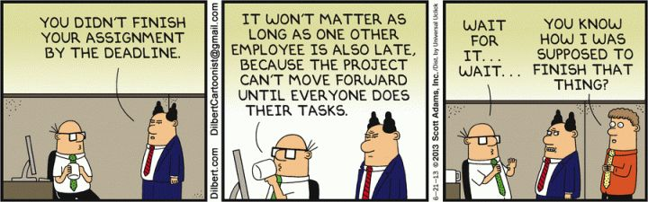

## Brainstorm notes
- <b>Shaping:</b> Define the work
    - Project Planning
    - Quality Control
- <b>Betting:</b> Choosing the work and trying to bring value
    - Risk Management
- <b>Managing:</b> Coordinating developer time & effort
    - Resource Management
    - Communication
    - Timeline Management
    - Scope Management
    - Budget Management
    - Stakeholder Engagement

## References

- What is Project Management
    - Source: https://www.pmi.org/about/learn-about-pmi/what-is-project-management

- 10 Common Project Management Challenges
    - https://monday.com/blog/project-management/project-management-challenges/#:~:text=Failure%20to%20set%20appropriate%20goals,a%20primary%20cause%20of%20failure

## Blog

The "Golden Standard" for a Project Manager is someone who shapes the work carried out by their team. This includes project planning, requirement gathering, timeline estimation, setting acceptance criteria, and implementing quality control methods such as unit testing. Often, this work is based on the expectations of the Project Manager and Stakeholders.

In the ever-evolving technological field, companies continuously strive to remain relevant by incorporating new technologies into their product and potentially leading innovation. For example, artificial intelligence has become incredibly prevalent in the software domain since Open AI went public. As a result, every SaaS company is now racing to integrate AI into their workflows and products to maintain their competitive edge. 

Effective management can be considered the most critical component of the Project Manager role. Consistent communication with the team is essential to ensure that the laid out timeline is being followed and to address any conflicts or blockers that may impede a developer from completing their tasks. Additionally, Project Managers will often be tasked with leading communication between the team and stakeholders to ensure that what is being produced aligns with the stakeholders' vision.

However, in reality, Project Managers may not meet this "Golden Standard." They may not be technologically inclined, making it a challenge to shape the project effectively. Others may not be entirely familiar with the domain, resulting in betting on projects which bring little to no value. Often, the Project Manager role will excel at managing; they will ensure that their teams are successfully completing their tasks, and that the release schedule is being followed. But even then, they may find out something isn't ready to ship during a deadline since effective communication isn't necessarily always achieved through frequent communication.

### Dilbert Meme

